# ninjaUSB-util

[](https://opensource.org/licenses/Apache-2.0)
[](https://github.com/mr-u0b0dy/ninjaUSB-util/actions/workflows/ci.yml)

A Linux utility that bridges USB keyboard input to Bluetooth Low Energy (BLE) devices.

## Features

- **Real-time Keyboard Input Forwarding**: Captures keystrokes from USB keyboards
  and forwards them as HID reports over BLE
- **Exclusive Input Capture**: Grabbed keyboards are "frozen" - keystrokes don't
  reach the host system, preventing interference with local applications
- **Hot-plug Support**: Automatically detects when keyboards are connected or
  disconnected
- **Multi-keyboard Support**: Can monitor multiple USB keyboards simultaneously
- **BLE Device Discovery**: Scans for and connects to BLE devices
- **HID Compliance**: Sends standard 8-byte HID keyboard reports compatible with
  most BLE devices
- **Safe Exit Hotkey**: Use Alt+Ctrl+H to safely exit the program while capturing
  keystrokes (Ctrl+C is disabled to prevent accidental termination)
- **Modern Command-Line Interface**: Comprehensive argument parsing with help,
  version, and configuration options
- **Verbose Logging**: Detailed logging with configurable levels for debugging and
  monitoring
- **Comprehensive Testing**: Extensive unit test suite covering all core functionality
  with 100% test pass rate and excellent code coverage
- **Automatic Versioning**: Centralized version management with build information

## Quick Start

```bash
# Install dependencies (Ubuntu/Debian)
sudo apt install cmake qt6-base-dev qt6-connectivity-dev libudev-dev libevdev-dev

# Build
mkdir build && cd build
cmake ..
make

# Optionally run tests
cmake .. -DBUILD_TESTS=ON && make && ctest

# Run (requires sudo for keyboard access)
sudo ./ninja_util
```

## Usage

```bash
./ninja_util --help                # Show all options
./ninja_util --version             # Show version info
./ninja_util -V                    # Run with verbose logging
./ninja_util --list-devices        # List BLE devices
./ninja_util --disable-auto-connect # Disable auto-connect to single NinjaUSB device
```

### Auto-Connect Feature

By default, if exactly one NinjaUSB device is found during scanning, the utility will automatically connect to it. This can be disabled with the `--disable-auto-connect` option if you prefer to manually select devices.

### Connection Handling

- **Connection Timeout**: Automatically exits if BLE connection fails within 30 seconds
- **Error Recovery**: Provides detailed error messages for different connection failure types
- **Graceful Exit**: Safely terminates the program if unable to establish BLE connection

## Documentation

- **[User Guide](doc/USER_GUIDE.md)** - Installation, usage, and troubleshooting
- **[Contributing](CONTRIBUTING.md)** - Quick start for contributors
- **[Development](doc/DEVELOPMENT.md)** - Detailed development guide
- **[Architecture](doc/ARCHITECTURE.md)** - System architecture and design
- **[Testing](doc/TESTING.md)** - Testing procedures
- **[Versioning](doc/VERSIONING.md)** - Version management

### Developer Resources

- **[Comprehensive Contributing Guide](doc/CONTRIBUTING.md)** - Complete
  development workflow
- **[CI/CD Pipeline](doc/PIPELINE.md)** - Pipeline documentation and
  troubleshooting
- **[Pull Request Template](.github/pull_request_template.md)** - PR guidelines
  and checklist

## Related Projects

### ninjaUSB - BLE to USB HID Bridge Firmware

This utility complements the **ninjaUSB** project - a Zephyr-based firmware for the
nRF52840 dongle that creates a BLE to USB HID bridge.

- **Repository**: [ninjaUSB](https://github.com/mr-u0b0dy/ninjaUSB/tree/dev)
- **Purpose**: nRF52840-based firmware that receives keystrokes via BLE and outputs
  them through USB HID
- **Architecture**: Reverse bridge - while ninjaUSB-util sends USB→BLE, ninjaUSB
  receives BLE→USB
- **Hardware**: nRF52840 dongle running Zephyr RTOS
- **Use Case**: Together, these projects create a complete wireless keyboard bridge
  solution

### Project Ecosystem

```mermaid
flowchart LR
    A[USB Keyboard<br/>/dev/input/eventX] --> B[ninjaUSB-util<br/>this project<br/>• BLE Client<br/>• Input capture]
    B --> C[ninjaUSB Device<br/>nRF52840<br/>• BLE Server<br/>• USB HID output]
    C --> D[Target Device<br/>via USB HID]
```



## License

Licensed under the Apache License 2.0 - see [LICENSE](LICENSE) file.

## 🧪 Testing

The project includes comprehensive unit tests with 100% pass rate:

```bash
# Build and run tests
cmake -B build -DCMAKE_BUILD_TYPE=Debug
cmake --build build
cd build && ctest --output-on-failure
```

**Test Coverage:**

- ✅ Device management and hot-plug detection
- ✅ Command-line argument parsing (fixed v1.1.1)
- ✅ HID keyboard mappings and state management
- ✅ Logging system with multiple levels
- ✅ Exit hotkey detection (Alt+Ctrl+H)
- ✅ Signal handling for graceful shutdown
- ✅ BLE report writer functionality

For detailed testing procedures, see [doc/TESTING.md](doc/TESTING.md).
