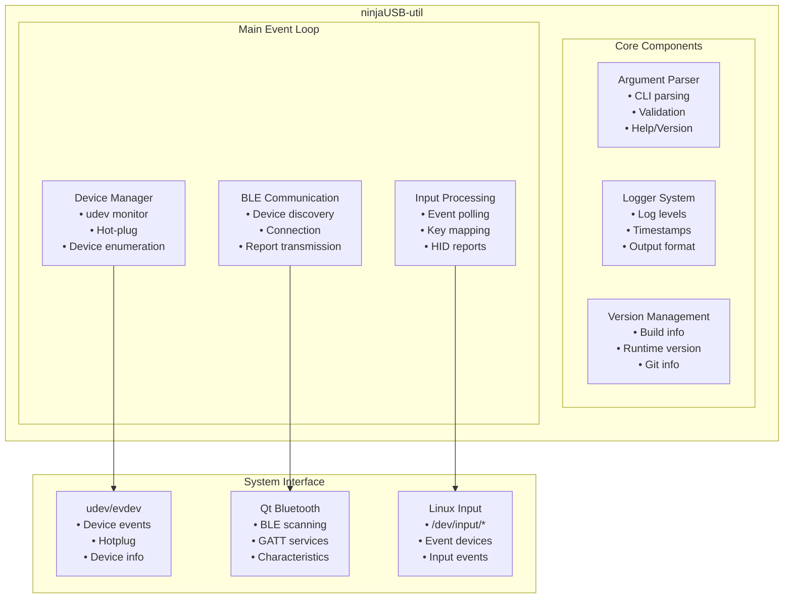
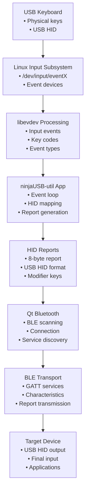

# Architecture Documentation

## Overview

ninjaUSB-util is a Linux utility that bridges USB keyboard input to Bluetooth Low
Energy (BLE) devices. This document describes the system architecture, component
design, and data flow.

## System Architecture

### High-Level Architecture

## Component Architecture

### 1. Device Manager (`device_manager.hpp/cpp`)

**Purpose**: Manages USB keyboard devices and provides hot-plug support.

**Key Classes**:

- `KeyboardDevice`: RAII wrapper for individual keyboard devices
- `KeyboardManager`: Manages multiple keyboards and monitors hot-plug events

**Responsibilities**:

- Enumerate existing keyboard devices at startup
- Monitor for hot-plug events (device connect/disconnect)
- Provide unified interface for polling keyboard events
- Handle device lifecycle management

**Dependencies**:

- `udev`: Device enumeration and hot-plug monitoring
- `libevdev`: Low-level input event handling
- Linux input subsystem (`/dev/input/eventX`)

### 2. Argument Parser (`args.hpp/cpp`)

**Purpose**: Parse and validate command-line arguments.

**Key Classes**:

- `Options`: Configuration structure
- `ArgumentParser`: Command-line parsing logic

**Responsibilities**:

- Parse command-line arguments with validation
- Provide help and version information
- Handle argument errors gracefully
- Support both short and long options

### 3. Logger (`logger.hpp/cpp`)

**Purpose**: Centralized logging system with configurable levels.

**Key Classes**:

- `Logger`: Singleton logging interface
- `LogLevel`: Enumeration of log levels

**Features**:

- Multiple log levels (DEBUG, INFO, WARNING, ERROR)
- Optional timestamps
- Thread-safe logging
- Configurable output format

### 4. Version Management (`version.hpp.in`, `version.hpp`)

**Purpose**: Centralized version information and build metadata.

**Components**:

- Version template (`version.hpp.in`)
- CMake-generated version header
- Runtime version queries
- Build timestamp and Git information

### 5. HID Key Mapping (`hid_keycodes.hpp`)

**Purpose**: Map Linux input events to USB HID usage codes.

**Functionality**:

- Linux key code to HID usage code mapping
- Modifier key handling
- HID keyboard report generation
- Key state management

## Data Flow Architecture

### Input Processing Pipeline

### Event Processing Flow

1. **Device Discovery**:
   - `udev` enumerates input devices
   - Filter for keyboard devices
   - Create `KeyboardDevice` instances

2. **Event Monitoring**:
   - `poll()` on device file descriptors
   - `libevdev` processes raw input events
   - Extract key codes and event types

3. **HID Report Generation**:
   - Map Linux key codes to HID usage codes
   - Build 8-byte HID keyboard reports
   - Handle modifier keys and combinations

4. **BLE Transmission**:
   - Qt Bluetooth discovers BLE devices
   - Connect to target device
   - Find writable HID characteristics
   - Transmit HID reports

## Threading Model

### Single-Threaded Design

The application uses a single-threaded, event-driven architecture:

- **Main Thread**: Handles all I/O operations
- **Event Loop**:
  - Polls keyboard devices for input events
  - Processes Qt Bluetooth events
  - Handles timer events and signals

**Rationale**:

- Simplifies synchronization
- Reduces complexity
- Adequate performance for keyboard input rates
- Qt's event system naturally fits this model

### Synchronization Points

- **Signal Handlers**: Atomic boolean for clean shutdown
- **Qt Events**: Event queue for BLE operations
- **Device Hot-plug**: Immediate processing in main loop

## Error Handling Strategy

### RAII Pattern

All resource management uses RAII:

- `KeyboardDevice`: Manages file descriptors and libevdev resources
- `KeyboardManager`: Manages udev context and monitor
- Qt objects: Automatic cleanup via parent-child relationships

### Error Propagation

- **Construction Failures**: Invalid objects with `is_valid()` checks
- **Runtime Errors**: Logged with appropriate severity
- **System Errors**: Graceful degradation when possible
- **Critical Errors**: Clean shutdown with error codes

### Logging Strategy

- **DEBUG**: Detailed trace information
- **INFO**: Important state changes
- **WARNING**: Recoverable errors
- **ERROR**: Serious problems requiring attention

## Performance Considerations

### Input Latency

- **Direct device polling**: Minimal latency overhead
- **Efficient HID mapping**: O(1) lookup tables
- **BLE without response**: Fastest transmission mode

### Memory Usage

- **Static allocations**: Avoid dynamic allocation in hot paths
- **Fixed-size reports**: 8-byte HID reports
- **Device caching**: Reuse device instances

### CPU Usage

- **Event-driven**: Only processes when events occur
- **Efficient polling**: Uses `poll()` system call
- **Minimal processing**: Direct key code mapping

## Security Considerations

### Privilege Requirements

- **Root access**: Required for `/dev/input/` access
- **Device permissions**: Direct hardware access
- **BLE permissions**: Bluetooth capability requirements

### Input Security

- **No key logging**: Events processed in real-time only
- **No storage**: No persistent key data
- **Direct forwarding**: Minimal processing time

### BLE Security

- **Connection security**: Uses Qt Bluetooth security features
- **No authentication**: Relies on BLE pairing
- **Data validation**: Validates HID report format

## Extension Points

### Adding New Input Sources

1. Create new device type in `device_manager`
2. Implement similar polling interface
3. Add to main event loop
4. Update HID mapping if needed

### Protocol Extensions

1. Add new HID report types
2. Extend mapping tables
3. Update BLE characteristics handling
4. Add configuration options

### Platform Support

1. Abstract system-specific code
2. Create platform-specific implementations
3. Update build system
4. Add platform detection

## Testing Architecture

### Unit Testing

- **Component isolation**: Each module tested independently
- **Mock interfaces**: For system dependencies
- **Boundary testing**: Edge cases and error conditions

### Integration Testing

- **End-to-end flows**: Full input processing pipeline
- **Hardware simulation**: Mock devices for testing
- **BLE simulation**: Test BLE communication

### Manual Testing

- **Real hardware**: Physical keyboard and BLE devices
- **Hot-plug testing**: Device connect/disconnect scenarios
- **Performance testing**: Latency and throughput validation

## Build System Architecture

### CMake Organization

- **Modular targets**: Separate libraries for each component
- **Version generation**: Automatic version header creation
- **Test integration**: CTest framework integration
- **Dependency management**: Find/link system libraries

### Version Management

- **Centralized version**: Single VERSION file
- **Build integration**: CMake template processing
- **Runtime access**: Generated version header
- **Git integration**: Commit hash and build time

This architecture provides a solid foundation for a reliable, maintainable, and extensible
USB-to-BLE keyboard bridge utility.
