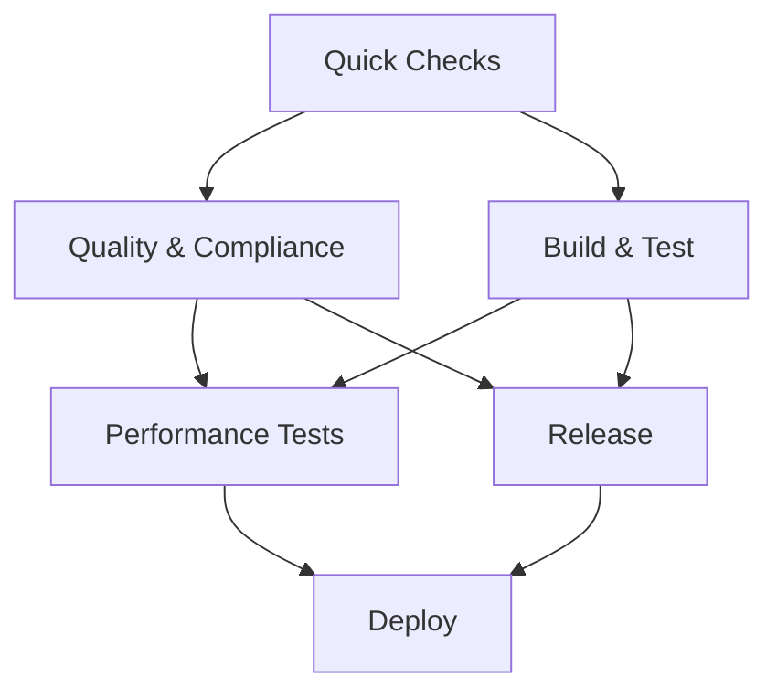

# 🚀 CI/CD Pipeline Documentation

This document describes the comprehensive CI/CD pipeline setup for ninjaUSB-util.

## 📋 Pipeline Overview

The CI/CD pipeline consists of a single comprehensive GitHub Actions workflow that provides **strict quality enforcement** with zero tolerance for quality violations:

- ⚡ **Quick Validation**: Fast feedback with immediate file and change validation - **FAIL ON VIOLATIONS**
- 🏗️ **Parallel Processing**: Quality checks and builds run simultaneously for efficiency
- ✅ **Comprehensive Testing**: Multi-platform builds with extensive test coverage - **FAIL ON TEST FAILURES**
- 🔍 **Quality Assurance**: Code analysis, formatting, documentation, and compliance checks - **FAIL ON WARNINGS**
- 📚 **Documentation**: Automated documentation generation and validation - **FAIL ON LINT ERRORS**
- 🚀 **Release Management**: Automated releases with complete artifact packaging
- 🎯 **Performance Testing**: Optional performance validation on demand
- 🚨 **Strict Enforcement**: All warnings treated as errors, immediate pipeline failure on violations

## 🔧 Workflow Architecture

### Main CI/CD Pipeline (`.github/workflows/ci.yml`)

**Triggers:**

- Push to `main`, `dev`, `feature/*` branches
- Pull requests to `main`, `dev`
- Tags starting with `v*`
- Manual workflow dispatch with debugging options

**Pipeline Flow:**



### Job Details

#### 1. **Quick Checks** (Job 1) - Fast Feedback

**Purpose:** Immediate validation to fail fast on obvious issues
**Runtime:** ~30 seconds

**Steps:**

- File change detection (only build if relevant files changed)
- C++ source file discovery
- Basic file validation (encoding, structure)
- ASCII/UTF-8 encoding verification for source files (documentation files skipped)

**Outputs:**

- `should-build`: Whether build is needed based on file changes
- `has-cpp-files`: Whether C++ source files exist

#### 2. **Quality & Compliance** (Job 2) - Parallel Quality Checks

**Purpose:** Comprehensive quality validation across multiple dimensions
**Dependencies:** `quick-checks`
**Strategy:** Matrix execution across 5 check types
**Runtime:** ~10-15 minutes per check type

**Matrix Jobs:**

**a) License & SPDX Compliance (`license-spdx`)** *(STRICT ENFORCEMENT)*

- SPDX identifier validation in source files - **FAIL ON MISSING/INVALID SPDX**
- License file existence and content validation - **FAIL ON MISSING LICENSE**
- License header verification - **FAIL ON MISSING HEADERS**
- README license mention check - **FAIL ON MISSING LICENSE SECTION**
- Comprehensive compliance reporting with strict validation

**b) YAML & Markdown Quality (`yaml-markdown`)** *(STRICT ENFORCEMENT)*

- YAML linting with `yamllint` - **FAIL ON LINT ERRORS**
- Enhanced Markdown linting with `markdownlint-cli2` - **FAIL ON ALL WARNINGS**
- Custom markdownlint configuration with strict rules
- Broken link detection for relative Markdown links - **FAIL ON BROKEN LINKS**
- Missing alt text detection for images - **FAIL ON MISSING ALT TEXT**
- Trailing whitespace detection - **FAIL ON WHITESPACE VIOLATIONS**
- Mermaid diagram syntax validation - **FAIL ON SYNTAX ERRORS**

**c) C++ Analysis (`cpp-analysis`)** *(STRICT ENFORCEMENT)*

- Code formatting validation with `clang-format` - **FAIL ON FORMAT VIOLATIONS**
- Static analysis with `cppcheck` - **FAIL ON CODE QUALITY ISSUES**
- Advanced analysis with `clang-tidy` - **FAIL ON STYLE/SAFETY VIOLATIONS**
- Cyclomatic complexity analysis - **FAIL ON EXCESSIVE COMPLEXITY**
- Function and line count metrics with strict thresholds
- Build system integration for comprehensive analysis

**d) File Validation (`file-validation`)** *(STRICT ENFORCEMENT)*

- File encoding verification (ASCII/UTF-8 for source files) - **FAIL ON ENCODING VIOLATIONS**
- Documentation file encoding checks skipped for flexibility
- Unexpected executable file detection - **FAIL ON UNAUTHORIZED EXECUTABLES**
- Large file detection (>1MB) - **FAIL ON OVERSIZED FILES**
- File structure validation with strict compliance requirements

**e) Documentation Validation (`docs-validation`)** *(STRICT ENFORCEMENT)*

- README.md quality assessment (word count, sections) - **FAIL ON INSUFFICIENT QUALITY**
- Essential section verification (installation, usage, build, license) - **FAIL ON MISSING SECTIONS**
- Documentation directory structure validation - **FAIL ON STRUCTURE VIOLATIONS**
- Inline documentation coverage calculation - **FAIL ON LOW COVERAGE**
- Doxygen configuration validation and test builds - **FAIL ON BUILD ERRORS**
- Documentation coverage reporting (percentage of documented files) - **FAIL BELOW THRESHOLD**

#### 3. **Build & Test** (Job 3) - Comprehensive Build Matrix

**Purpose:** Multi-platform builds with extensive testing
**Dependencies:** `quick-checks`
**Condition:** Only runs if `should-build == true`
**Strategy:** Matrix across Ubuntu versions and build types

**Build Matrix:**

- **Ubuntu 22.04:** Release build with Qt 6.4.*
- **Ubuntu 24.04:** Release build with Qt 6.6.*
- **Ubuntu 24.04:** Debug build with tests and docs enabled

**Build Features:**

- **Caching Strategy:** APT packages, build artifacts, ccache
- **Incremental Builds:** ccache for faster compilation
- **Dependency Management:** Automatic installation of system dependencies
- **Documentation Tools:** Doxygen, Graphviz, PlantUML, LaTeX
- **Testing Tools:** Valgrind, cppcheck, clang-tidy

**Build Process:**

1. **System Setup:** Install dependencies with caching
2. **Documentation Tools:** Install comprehensive doc generation tools
3. **Testing Tools:** Install analysis and debugging tools
4. **Source Checkout:** Full git history for version detection
5. **Build Configuration:** CMake with optimized settings
6. **Compilation:** Parallel build with verbose output
7. **Testing:** Comprehensive test execution with CTest
8. **Static Analysis:** Runtime analysis integration
9. **Documentation Build:** API documentation generation
10. **Artifact Upload:** Binaries and documentation packaging

**Artifact Outputs:**

- Binary executables for each Ubuntu version
- Generated documentation (HTML/PDF)
- Build logs and test results
- Version information

#### 4. **Performance Tests** (Job 4) - Optional Performance Validation

**Purpose:** In-depth performance analysis and memory validation
**Trigger:** Commit messages containing `[perf]`
**Runtime:** ~5-10 minutes

**Performance Checks:**

- **Memory Analysis:** Valgrind leak detection with full reporting
- **Performance Timing:** Execution time measurement
- **Resource Usage:** Memory and CPU profiling
- **Regression Detection:** Performance trend analysis

#### 5. **Release** (Job 5) - Automated Release Management

**Purpose:** Complete release package preparation
**Dependencies:** Both `build-matrix` and `quality-compliance`
**Trigger:** Git tags starting with `v*`

**Release Process:**

1. **Artifact Collection:** Download all build and documentation artifacts
2. **Package Preparation:** Organize binaries and documentation
3. **Documentation Inclusion:** Complete documentation sets
4. **Project Files:** Include README, LICENSE, VERSION
5. **Archive Creation:** Compressed release packages
6. **Asset Upload:** Release artifacts with extended retention

## 🛠️ Development Workflow Integration

### Environment Variables

The pipeline supports several environment variables for customization:

- `BUILD_TYPE`: Default build type (Release)
- `CACHE_VERSION`: Cache version for invalidation (v2)
- `DEBIAN_FRONTEND`: Non-interactive package installation

### Workflow Dispatch Options

Manual workflow triggers support:

- **Debug Mode**: Enable verbose debugging output
- **Skip Tests**: Bypass test execution for rapid builds

### Conditional Execution

Smart execution based on:

- **File Changes**: Only builds when relevant files change
- **Performance Triggers**: Performance tests run on `[perf]` commit messages
- **Release Triggers**: Release process activates on version tags

## 📊 Quality Gates - Strict Enforcement

Every pull request must pass these automated checks. **All quality gates are strictly enforced - warnings are treated as errors and will fail the pipeline.**

### 1. ✅ **Quick Validation** *(STRICT)*

- File encoding verification (ASCII/UTF-8 for source files) - **FAIL ON ERROR**
- Basic file structure validation - **FAIL ON ERROR**
- Change relevance detection
- Documentation file encoding checks skipped for flexibility

### 2. 🔍 **Quality Compliance** *(STRICT)*

- **License Compliance**: SPDX headers and license validation - **FAIL ON MISSING/INVALID**
- **Code Quality**: Formatting, static analysis, complexity checks - **FAIL ON VIOLATIONS**
- **Documentation**: Coverage analysis and validation - **FAIL ON INSUFFICIENT COVERAGE**
- **File Standards**: Source file encoding (ASCII/UTF-8), structure, and size validation - **FAIL ON VIOLATIONS**
- **Markup Quality**: YAML and Markdown linting - **FAIL ON LINT ERRORS**
- **Link Validation**: Broken markdown links - **FAIL ON BROKEN LINKS**
- **Mermaid Diagrams**: Syntax validation - **FAIL ON SYNTAX ERRORS**

### 3. 🏗️ **Build Success** *(STRICT)*

- Multi-platform compilation (Ubuntu 22.04, 24.04) - **FAIL ON BUILD ERRORS**
- Debug and Release configurations - **FAIL ON COMPILATION FAILURES**
- Dependency resolution and caching - **FAIL ON UNMET DEPENDENCIES**
- C++ formatting validation with clang-format - **FAIL ON FORMAT VIOLATIONS**

### 4. 🧪 **Test Coverage** *(STRICT)*

- Unit test execution with CTest - **FAIL ON TEST FAILURES**
- Memory leak detection with Valgrind - **FAIL ON MEMORY LEAKS**
- Static analysis integration - **FAIL ON CRITICAL ISSUES**
- cppcheck analysis - **FAIL ON CODE QUALITY ISSUES**
- clang-tidy validation - **FAIL ON STYLE/SAFETY VIOLATIONS**

### 5. 📚 **Documentation Standards** *(STRICT)*

- API documentation coverage (>50% target) - **FAIL ON INSUFFICIENT COVERAGE**
- Doxygen build validation - **FAIL ON BUILD ERRORS**
- Essential README sections - **FAIL ON MISSING SECTIONS**
- Markdown quality standards - **FAIL ON LINT WARNINGS**
- License header verification - **FAIL ON MISSING HEADERS**

### 🚨 **Strict Enforcement Policy**

- **Zero Tolerance**: All warnings are treated as errors
- **Immediate Failure**: Pipeline fails on first quality violation
- **No Bypassing**: Manual overrides are not permitted
- **Complete Validation**: All files and changes are validated
- **Comprehensive Checks**: Multi-dimensional quality validation

## 🚀 Release Process

### Automated Release Workflow

The release process is fully automated through Git tags:

1. **Version Preparation**

   ```bash
   # Update version file
   echo "1.2.3" > VERSION

   # Commit version update
   git add VERSION
   git commit -m "Release v1.2.3"
   ```

2. **Tag Creation and Push**

   ```bash
   # Create and push tag
   git tag v1.2.3
   git push origin main
   git push origin v1.2.3
   ```

3. **Automated Pipeline Execution**
   - Triggers comprehensive build matrix
   - Executes full quality validation
   - Generates documentation
   - Creates release artifacts

4. **Release Package Contents**
   - Binary executables for all supported platforms
   - Complete API documentation (HTML/PDF)
   - Project documentation (README, LICENSE, etc.)
   - Version information and build metadata

### Release Artifacts

Each release includes:

- **Binaries**: `ninja_util` executable for Ubuntu 22.04, 24.04
- **Documentation**: Complete API docs and user guides
- **Metadata**: Version, build information, checksums
- **Archive**: Compressed `.tar.gz` package with all assets

## 🔍 Monitoring & Quality Metrics

### Build Metrics

- **Success Rate**: Build success percentage across platforms
- **Build Time**: Compilation time trends and optimization
- **Artifact Size**: Binary size tracking and regression detection
- **Cache Efficiency**: ccache hit rates and optimization

### Code Quality Metrics

- **Static Analysis**: Issue trends from cppcheck and clang-tidy
- **Code Coverage**: Test coverage percentage and trends
- **Documentation Coverage**: API documentation completeness
- **Complexity**: Cyclomatic complexity trends

### Performance Metrics

- **Memory Usage**: Valgrind analysis and leak detection
- **Execution Time**: Performance benchmark trends
- **Resource Utilization**: CPU and memory profiling

## 🐛 Troubleshooting Guide

### Common Build Issues

**Qt6 Dependency Problems:**

```bash
# Check Qt6 installation
pkg-config --list-all | grep Qt6
apt list --installed | grep qt6
```

**CMake Configuration Issues:**

```bash
# Verify CMake version
cmake --version  # Should be >= 3.20

# Clean and reconfigure
rm -rf build/
mkdir build && cd build
cmake .. -DCMAKE_BUILD_TYPE=Debug -DBUILD_TESTS=ON
```

**Memory Test Failures:**

```bash
# Run Valgrind locally
cd build
valgrind --leak-check=full --show-leak-kinds=all ./ninja_util --help
```

### CI Pipeline Debugging

**View Pipeline Logs:**

1. Navigate to [GitHub Actions](https://github.com/your-username/ninjaUSB-util/actions)
2. Select the failing workflow run
3. Expand job details and step logs

**Local CI Testing:**

```bash
# Install dependencies locally
sudo apt update
sudo apt install build-essential cmake qt6-base-dev qt6-connectivity-dev

# Run equivalent build locally
mkdir build && cd build
cmake .. -DCMAKE_BUILD_TYPE=Release
make -j$(nproc)
ctest --output-on-failure
```

**Quality Check Debugging:**

```bash
# Run formatting check
find src tests -name "*.cpp" -o -name "*.hpp" | xargs clang-format --dry-run --Werror

# Run static analysis
cppcheck --enable=all --std=c++17 src/ tests/

# Check documentation
doxygen Doxyfile  # If Doxyfile exists
```

## 📈 Performance Optimization

### Build Optimization

- **Parallel Compilation**: Uses all available CPU cores
- **Compiler Cache**: ccache for incremental builds
- **Dependency Caching**: APT package and build artifact caching
- **Smart Rebuilds**: Only rebuilds when source files change

### CI Efficiency

- **Fast Feedback**: Quick checks run first (30 seconds)
- **Parallel Execution**: Quality and build jobs run simultaneously
- **Conditional Execution**: Skips unnecessary work based on file changes
- **Artifact Reuse**: Shares build artifacts between jobs

## 🔧 Configuration Files

| File | Purpose | Description |
|------|---------|-------------|
| `.github/workflows/ci.yml` | Main CI/CD pipeline | Complete automation workflow |
| `.markdownlint.json` | Markdown linting rules | Auto-generated during quality checks |
| `CMakeLists.txt` | Build configuration | CMake build system setup |
| `VERSION` | Version tracking | Current project version |
| `doc/PIPELINE.md` | Pipeline documentation | This document |

## 🎯 Future Enhancements

### Planned Improvements

- [ ] **Multi-Architecture Support**: ARM64 builds
- [ ] **Cross-Platform Builds**: Windows and macOS support
- [ ] **Container Publishing**: Docker image releases
- [ ] **Package Management**: APT/Snap package publishing
- [ ] **Advanced Analytics**: Detailed performance trend analysis
- [ ] **Security Scanning**: Advanced vulnerability detection
- [ ] **Dependency Management**: Automated dependency updates

### Metrics Dashboard

Consider implementing:

- Real-time build status dashboard
- Code quality trend visualization
- Performance regression alerts
- Security posture monitoring

## 📞 Support & Contact

### Getting Help

1. **Documentation**: Review this guide and linked documentation
2. **GitHub Issues**: Create issues with `ci` or `pipeline` labels
3. **Discussions**: Use GitHub Discussions for questions
4. **Maintainer Contact**: Tag repository maintainers in issues

### Pipeline Status

- **Current Status**: ✅ Active and Fully Operational
- **Last Updated**: June 2025
- **Next Review**: Quarterly evaluation scheduled
- **Monitoring**: Continuous automated monitoring active

---

**Pipeline Version**: 3.0 (Strict Enforcement)
**Documentation Version**: 3.0
**Last Updated**: June 2025
**Compatibility**: GitHub Actions, Ubuntu 22.04+, Qt6+
**Enforcement Policy**: Zero Tolerance for Quality Violations
