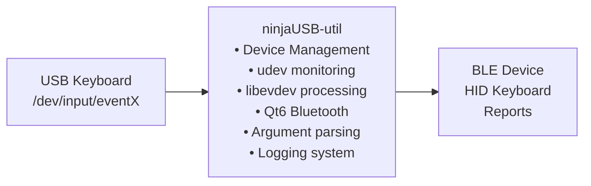
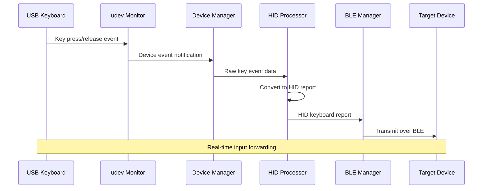

# User Guide

Complete guide for using ninjaUSB-util.

## What is ninjaUSB-util?

A Linux utility that bridges USB keyboard input to Bluetooth Low Energy (BLE)
devices, enabling you to use your physical keyboard to control BLE devices that
accept HID keyboard input.

## How It Works

1. **Keyboard Monitoring**: Uses `udev` and `libevdev` to monitor Linux input
   devices (`/dev/input/eventX`)
2. **Input Processing**: Converts Linux keyboard events to USB HID usage codes
3. **BLE Communication**: Uses Qt6 Bluetooth to discover and connect to BLE devices
4. **Report Transmission**: Sends HID keyboard reports to writable BLE characteristics

## Installation

### Ubuntu/Debian

```bash
sudo apt install cmake build-essential pkg-config
sudo apt install qt6-base-dev qt6-bluetooth-dev
sudo apt install libudev-dev libevdev-dev
```

### Arch Linux

```bash
sudo pacman -S cmake base-devel pkg-config
sudo pacman -S qt6-base qt6-connectivity
sudo pacman -S libevdev systemd
```

### Specific Distribution Instructions

#### Fedora/RHEL/CentOS

```bash
sudo dnf install cmake gcc-c++ qt6-qtbase-devel qt6-qtconnectivity-devel
sudo dnf install libudev-devel libevdev-devel
```

#### openSUSE

```bash
sudo zypper install cmake gcc-c++ qt6-base-devel qt6-bluetooth-devel
sudo zypper install libudev-devel libevdev-devel
```

## Building

```bash
# Clone the repository
git clone <repository-url>
cd ninjaUSB-util

# Create build directory
mkdir build && cd build

# Configure and build
cmake ..
make

# Build with tests (optional)
cmake .. -DBUILD_TESTS=ON
make

# Run tests
ctest

# Or use ninja if available
cmake -G Ninja ..
ninja
```

## Command Line Options

### Basic Options

| Option | Short | Description |
|--------|-------|-------------|
| `--help` | `-h` | Show comprehensive help message and exit |
| `--version` | `-v` | Display version information and build details |
| `--verbose` | `-V` | Enable verbose logging output for debugging |

### Device Management

| Option | Description | Default |
|--------|-------------|---------|
| `--list-devices` | List available BLE devices and exit | N/A |
| `--target <address>` | Connect to specific BLE device by MAC address | Interactive selection |
| `--scan-timeout <ms>` | BLE device scan timeout in milliseconds | 10000 |
| `--poll-interval <ms>` | Input polling interval in milliseconds | 1 |

### Logging Options

| Option | Description | Valid Values |
|--------|-------------|-------------|
| `--log-level <level>` | Set logging verbosity level | `debug`, `info`, `warn`, `error` |

### Usage Examples

```bash
# Show help
./ninja_util --help

# Show version information
./ninja_util --version

# Run with verbose logging
./ninja_util -V

# List available BLE devices
./ninja_util --list-devices

# Connect to specific device by MAC address
./ninja_util --target AA:BB:CC:DD:EE:FF

# Adjust scan timeout (default: 10000ms)
./ninja_util --scan-timeout 5000

# Adjust polling interval (default: 1ms) 
./ninja_util --poll-interval 10

# Set log level (debug, info, warn, error)
./ninja_util --log-level debug

# Combine options for customized operation
./ninja_util -V --scan-timeout 5000 --log-level debug --poll-interval 5
```

## Basic Usage

1. **Run the utility** (requires root privileges for keyboard access):

   ```bash
   sudo ./ninja_util
   ```

2. **Device Discovery**: The program will scan for BLE devices for 10 seconds and
   display a list

3. **Select Target Device**: Choose the device number you want to connect to

4. **Start Typing**: Once connected, keyboard input will be forwarded to the
   selected BLE device

5. **Exit**: Press Ctrl+C to quit the application gracefully

## Supported Keys

The utility supports a comprehensive set of keyboard keys including:

- **Alphabet keys** (A-Z)
- **Number row** (0-9)
- **Function keys** (F1-F12)
- **Modifier keys** (Ctrl, Alt, Shift, Meta/Windows)
- **Special keys** (Enter, Backspace, Tab, Space, Arrow keys)
- **Punctuation and symbols**

See `src/inc/hid_keycodes.hpp` for the complete mapping of Linux key codes to USB
HID usage IDs.

## Architecture



### Key Components

- **Device Manager**: Handles keyboard detection and hot-plug events
- **Argument Parser**: Modern CLI with comprehensive options
- **Logger**: Configurable logging with multiple levels
- **HID Processing**: Converts Linux input events to HID reports
- **BLE Communication**: Manages device discovery and connections
- **Version System**: Centralized version management from VERSION file

## Key Features

- **Real-time Input Forwarding**: Near-zero latency keyboard event forwarding
- **Hot-plug Support**: Automatic detection of keyboard connect/disconnect events
- **Multi-keyboard Support**: Can monitor multiple USB keyboards simultaneously
- **Comprehensive Key Support**: All standard keys, function keys, and modifiers
- **BLE Device Discovery**: Automatic scanning and connection to BLE devices
- **Robust Error Handling**: Graceful handling of device disconnections and errors
- **Configurable Logging**: Multiple log levels for debugging and monitoring
- **Modern CLI**: Comprehensive command-line interface with extensive options

## Troubleshooting

### Permission Issues

- Run with `sudo` to access input devices
- Ensure your user is in the `input` group: `sudo usermod -a -G input $USER`

### No Keyboards Detected

- Check if keyboards appear in `/dev/input/`: `ls -la /dev/input/event*`
- Verify udev is working: `udevadm monitor --subsystem-match=input`

### BLE Connection Issues

- Ensure Bluetooth is enabled: `bluetoothctl power on`
- Check if the target device is in pairing/discoverable mode
- Verify Qt6 Bluetooth is properly installed

### Build Errors

- Ensure all dependencies are installed
- Check Qt6 installation: `qmake6 --version` or `pkg-config --modversion Qt6Core`
- For Qt6 issues, verify both base and connectivity modules are installed
- On older systems, Qt6 might not be available in default repositories

### Development Build

For development or testing the latest features:

```bash
# Clone the repository
git clone https://github.com/mr-u0b0dy/ninjaUSB-util.git
cd ninjaUSB-util

# Build with all features enabled
mkdir build && cd build
cmake .. -DBUILD_TESTS=ON -DBUILD_DOCS=ON -DCMAKE_BUILD_TYPE=Debug
make -j$(nproc)

# Run tests to verify build
ctest --output-on-failure
```

## Advanced Usage

### Advanced Debugging

For troubleshooting issues, use verbose logging to get detailed information:

```bash
# Maximum verbosity for debugging
sudo ./ninja_util -V --log-level debug

# Monitor what's happening during device scan
sudo ./ninja_util --list-devices --log-level debug
```

### Performance Tuning

Adjust polling intervals based on your needs:

```bash
# Lower latency (higher CPU usage)
sudo ./ninja_util --poll-interval 1

# Lower CPU usage (slightly higher latency)
sudo ./ninja_util --poll-interval 10

# Extended scan time for devices in poor signal areas
sudo ./ninja_util --scan-timeout 20000
```

### Security Considerations

- **Root Privileges**: Required for accessing `/dev/input/` devices
- **Network Security**: BLE connections use device pairing security
- **Data Privacy**: No keystrokes are logged or stored permanently

## System Requirements

### Hardware Requirements

- **USB Keyboard**: Any standard USB keyboard (USB 2.0/3.0)
- **Bluetooth**: Bluetooth Low Energy (BLE) capable adapter
- **Target Device**: BLE device that accepts HID keyboard input

### Software Requirements

- **Linux Kernel**: 4.0+ (for modern udev and evdev support)
- **Qt6**: Version 6.2 or later with Bluetooth support
- **Build Tools**: GCC 7+ or Clang 6+ with C++17 support
- **Root Access**: Required for keyboard input device access

### Tested Platforms

Currently tested on:

- Ubuntu 22.04 LTS
- Development testing on various Linux distributions

**Note**: While the utility is designed to work across Linux distributions,
comprehensive multi-platform testing is ongoing. Community feedback and testing
reports are welcome.

## Frequently Asked Questions (FAQ)

### General Usage

**Q: Do I need to run the utility as root?**
A: Yes, root privileges are required to access keyboard input devices in `/dev/input/`.

**Q: Can I use wireless keyboards?**
A: Yes, as long as they appear as standard input devices in `/dev/input/eventX`.

**Q: Will this work with my gaming keyboard?**
A: Most gaming keyboards work fine. RGB lighting and macro keys may not be supported.

**Q: How many keyboards can I connect simultaneously?**
A: The utility can monitor multiple keyboards at once and forward input from all of them.

### Bluetooth and Connectivity

**Q: Why can't I see my BLE device?**
A: Ensure the device is in pairing/discoverable mode and supports HID keyboard input.

**Q: The connection keeps dropping. What can I do?**
A: Try increasing the scan timeout (`--scan-timeout 15000`) or check for interference.

**Q: Can I connect to multiple BLE devices?**
A: Currently, the utility connects to one BLE device at a time.

### Performance and Latency

**Q: I notice input lag. How can I reduce it?**
A: Lower the poll interval (`--poll-interval 1`) and ensure your system isn't under heavy load.

**Q: How much CPU does this use?**
A: Very minimal - typically less than 1% CPU usage on modern systems.

### Compatibility

**Q: Will this work on Wayland?**
A: Yes, the utility works on both X11 and Wayland since it accesses input devices directly.

**Q: Can I use this with virtual machines?**
A: USB passthrough to the VM is required for the utility to access keyboard devices.

### Common Issues

**Q: "Permission denied" errors when running**
A: Ensure you're running with `sudo` or add your user to the `input` group.

**Q: No keyboards detected**
A: Check if keyboards appear in `/dev/input/` and verify udev is working properly.

**Q: Build fails with Qt6 errors**
A: Ensure both `qt6-base-dev` and `qt6-connectivity-dev` (or equivalent) are installed.

## Related Documentation

For more detailed information, see:

- **[Architecture Guide](ARCHITECTURE.md)** - Technical system design and components
- **[Development Guide](DEVELOPMENT.md)** - Contributing and development setup
- **[Testing Guide](TESTING.md)** - Testing procedures and validation
- **[Contributing Guide](CONTRIBUTING.md)** - How to contribute to the project
- **[Versioning Guide](VERSIONING.md)** - Version management and release process

## Support and Community

### Getting Help

1. **Documentation**: Check the guides above for detailed information
2. **GitHub Issues**: Report bugs or request features
3. **GitHub Discussions**: Ask questions and share experiences
4. **Wiki**: Community-maintained tips and tricks (coming soon)

### Reporting Issues

When reporting issues, please include:

- Operating system and version
- Qt6 version (`qmake6 --version`)
- Kernel version (`uname -r`)
- Hardware details (keyboard model, BLE adapter)
- Steps to reproduce the issue
- Log output with `--log-level debug`

### Contributing

We welcome contributions! See [CONTRIBUTING.md](CONTRIBUTING.md) for:

- Code contribution guidelines
- Development environment setup
- Testing requirements
- Documentation standards

## Version Information

Current version: **1.0.0-dev** (Development Release)

For version history and changelog, see:

- [VERSION](../VERSION) file for current version
- [GitHub Releases](https://github.com/mr-u0b0dy/ninjaUSB-util/releases) for release notes
- [VERSIONING.md](VERSIONING.md) for version management details

## Data Flow


